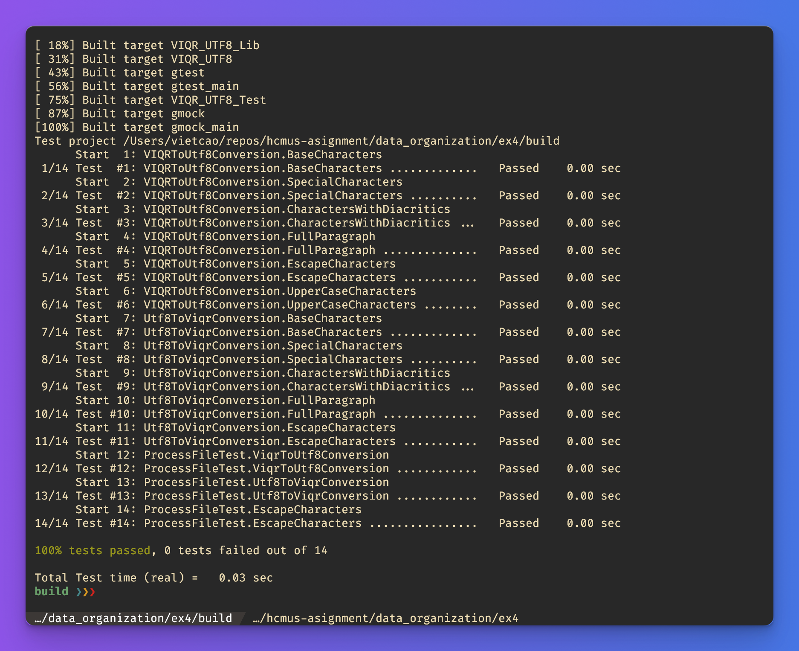

# VIQR_UTF8 Converter

## Project Overview

The VIQR_UTF8 Converter a console application to read Vietnamese text encoded in VIQR from an input file and output the corresponding in UTF8 format into an output file, and vice versa.

## Student Information

- Name: Cao Hoai Viet
- Student ID: 22850034
- Student Email: 22850034@student.hcmus.edu.vn

## Tech stack

- C++11
- CMake https://cmake.org/
- Google Test https://github.com/google/googletest

## Prerequisites

#### For Windows:

- Install CMake: https://cmake.org/download/

#### For Linux (Ubuntu):

```bash
sudo apt-get install cmake
```

#### For MacOS:

```bash
brew install cmake
```

## Build and Run

1. Extract the project files from the zip archive.
2. Open a terminal and navigate to the project directory.
3. Build the application using CMake:

```bash
cd VIQR_UTF8
mkdir build
cd build
cmake ..
cmake --build .
```

2. Run the application:

```bash
# Init the in.txt file
echo "Vie^.t Nam dda^'t nu*o*'c me^'n ye^u\.!" > in.txt
# Run the application
./VIQR_UTF8 1 in.txt out.txt
# View the result
cat out.txt
```

## Project Structure

```
VIQR_UTF8/
│
├── build/                      # Build directory for out-of-source builds
│   ├── (generated files)       # Contains CMake generated files and compiled binaries
├── CMakeLists.txt              # Main CMake configuration file, defines how to build the project
├── FileProcessor.h             # Header file for the FileProcessor class, which handles file operations
├── FileProcessor.cpp           # Implementation file for the FileProcessor class
├── FileProcessor_test.cpp      # Tests for the FileProcessor functionality
├── main.cpp                    # The main entry point for the application, contains the main function
├── README.md                   # Project information and documentation
├── README_Vietnamese.md        # Project information and documentation in Vietnamese
├── VIQR_UTF8.h                 # Header file for the functions
├── VIQR_UTF8.cpp               # Implementation of the functions
├── VIQR_UTF8_test.cpp          # Tests for the VIQR to UTF-8 conversion functionality
```

## Unit tests

The project uses Google Test for unit testing. The tests are defined in the `FileProcessor_test.cpp` and `VIQR_UTF8_test.cpp` files.

To run the tests, build the project and run the following commands:

```bash
cd build
cmake --build . && ctest
```

Test cases:

- VIQRToUtf8Conversion.BaseCharacters
- VIQRToUtf8Conversion.SpecialCharacters
- VIQRToUtf8Conversion.CharactersWithDiacritics
- VIQRToUtf8Conversion.FullParagraph
- VIQRToUtf8Conversion.EscapeCharacters
- VIQRToUtf8Conversion.UpperCaseCharacters
- Utf8ToViqrConversion.BaseCharacters
- Utf8ToViqrConversion.SpecialCharacters
- Utf8ToViqrConversion.CharactersWithDiacritics
- Utf8ToViqrConversion.FullParagraph
- Utf8ToViqrConversion.EscapeCharacters
- ProcessFileTest.ViqrToUtf8Conversion
- ProcessFileTest.Utf8ToViqrConversion
- ProcessFileTest.EscapeCharacters

Example of a test result:

