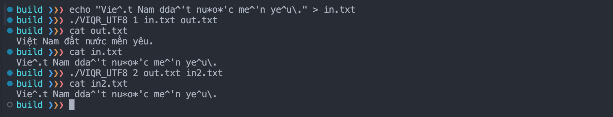

# VIQR_UTF8 Converter

## Project Overview

The VIQR_UTF8 Converter a console application to read Vietnamese text encoded in VIQR from an input file and output the corresponding in UTF8 format into an output file, and vice versa.

## Student Information

- Name: Cao Hoai Viet
- Student ID: 22850034
- Student Email: 22850034@student.hcmus.edu.vn
- Github Repository: https://github.com/vietch2612/22850034-hcmus-assignment/tree/main/data_organization/ex4

Self-assess job completion: 100%

| Task                     | Status  |
| ------------------------ | ------- |
| Code                     | &check; |
| Build on macOS & Windows | &check; |
| Unit test                | &check; |
| Documentation            | &check; |

## Tech stack

- C++11
- CMake https://cmake.org/
- Google Test https://github.com/google/googletest

## Prerequisites

#### For Windows:

- Install CMake: https://cmake.org/download/

#### For Linux (Ubuntu):

```bash
sudo apt-get install cmake
```

#### For MacOS:

```bash
brew install cmake
```

## Build

1. Extract the project files from the zip archive.
2. Open a terminal and navigate to the project directory.
3. Build the application using CMake:

For Mac and Linux

```bash
cd VIQR_UTF8
mkdir build
cd build
cmake ..
cmake --build . --config Release
```

For Windows (PowerShell)

```bash
cd VIQR_UTF8
mkdir build
cd build
cmake .. -G"Visual Studio 17 2022"
cmake --build . --config Release
```

## Run

For Mac and Linux

```bash
# Run inside the build folder
# Init the in.txt file
echo "Vie^.t Nam dda^'t nu*o*'c me^'n ye^u\." > in.txt
# Run the application
./VIQR_UTF8 1 in.txt out.txt
# View the result
cat out.txt
```

For Windows (PowerShell)

```bash
# Open the Release folder inside the build folder
cd Release
# Init the in.txt file with ASCII encoding
echo "Vie^.t Nam dda^'t nu*o*'c me^'n ye^u\." | Out-File -FilePath in.txt -Encoding ascii
.\VIQR_UTF8.exe 1 in.txt out.txt
# View the result
.\out.txt
# Convert back to VIQR
./VIQR_UTF8.exe 2 out.txt in2.txt
# View the result
cat in2.txt
```

#### Screenshots of the application running:

macOS:


Windows:


## Project Structure

```

VIQR_UTF8/
│
├── build/ # Build directory for out-of-source builds
│ ├── Release/ # Contains the compiled application (Windows)
│ ├── (generated files) # Contains CMake generated files and compiled binaries
├── CMakeLists.txt # Main CMake configuration file, defines how to build the project
├── FileProcessor.h # Header file for the FileProcessor class, which handles file operations
├── FileProcessor.cpp # Implementation file for the FileProcessor class
├── FileProcessor_test.cpp # Tests for the FileProcessor functionality
├── main.cpp # The main entry point for the application, contains the main function
├── README.md # Project information and documentation
├── README_Vietnamese.md # Project information and documentation in Vietnamese
├── VIQR_UTF8.h # Header file for the functions
├── VIQR_UTF8.cpp # Implementation of the functions
├── VIQR_UTF8_test.cpp # Tests for the VIQR to UTF-8 conversion functionality
├── screenshots/ # Contains screenshots for the README
│ ├── *.png # Sample screenshots
└── (other files) # Other project files

```

1. The `FileProcessor` class is responsible for reading and writing files.
2. The `VIQR_UTF8` class is responsible for converting text between VIQR and UTF-8 formats. It contains:
   - Vector of pairs of VIQR and UTF-8 characters
   - `viqrToUtf8`: VIQR to UTF-8 conversion
   - `utf8ToViqr`: UTF-8 to VIQR conversion

## How it works

1. The `ProcessFile` function reads the input file and calls the `viqrToUtf8` or `utf8ToViqr` in the `VIQR_UTF8` class to convert the text depending on the mode.
2. The `viqrToUtf8` function converts the VIQR text to UTF-8 text.
   - The first loop reads the input text character by character.
   - The second loop checks if the character is a VIQR character or not by comparing each VIQR from `viqrChars` with current character and index `i` to `i+viqrChars[j].length()`.
   - If the character is a VIQR character, the function replaces it with the corresponding UTF-8 character.
   - If the character is not a VIQR character, the function appends it to the output text.
3. The `utf8ToViqr` function converts the UTF-8 text to VIQR text.
   - The method is similar to the `viqrToUtf8` function but in reverse.

## Unit tests

The project uses Google Test for unit testing. The tests are defined in the `FileProcessor_test.cpp` and `VIQR_UTF8_test.cpp` files. Unit tet helps to ensure that the functions work as expected whenever changes are made to the code.

To run the tests, build the project and run the following commands:

```bash
cd build
cmake --build . && ctest
```

The list of test cases are defined to cover all\* the possible scenarios:

- VIQRToUtf8Conversion.BaseCharacters
- VIQRToUtf8Conversion.SpecialCharacters
- VIQRToUtf8Conversion.CharactersWithDiacritics
- VIQRToUtf8Conversion.FullParagraph
- VIQRToUtf8Conversion.EscapeCharacters
- VIQRToUtf8Conversion.UpperCaseCharacters
- Utf8ToViqrConversion.BaseCharacters
- Utf8ToViqrConversion.SpecialCharacters
- Utf8ToViqrConversion.CharactersWithDiacritics
- Utf8ToViqrConversion.FullParagraph
- Utf8ToViqrConversion.EscapeCharacters
- ProcessFileTest.ViqrToUtf8Conversion
- ProcessFileTest.Utf8ToViqrConversion
- ProcessFileTest.EscapeCharacters

Sample test result:

