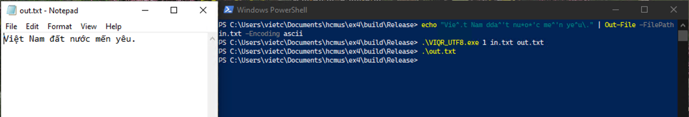
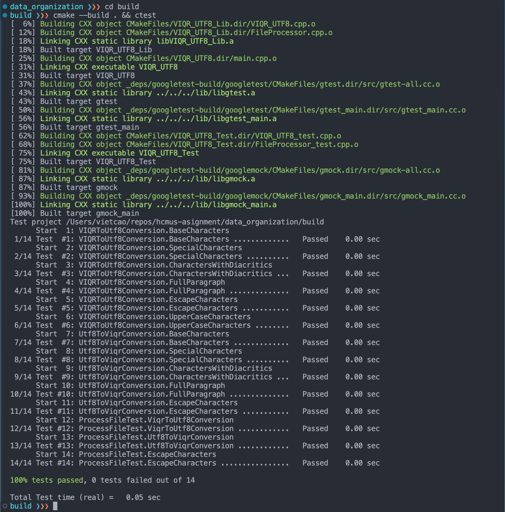

# VIQR_UTF8 Converter

## Tổng quan chương trình

VIQR_UTF8 Converter là Console Application để đọc văn bản tiếng Việt được mã hóa bằng VIQR từ một tệp đầu vào và xuất ra dưới dạng UTF8 tương ứng vào một tệp đầu ra, và ngược lại.

## Student Information

- Họ và tên: Cao Hoài Việt
- MSSV: 22850034
- Email: 22850034@student.hcmus.edu.vn
- Github Repository: https://github.com/vietch2612/22850034-hcmus-assignment/tree/main/data_organization/ex4

Tự đánh giá mức độ hoàn thành: 100%

| Task                     | Status  |
| ------------------------ | ------- |
| Code                     | &check; |
| Build on macOS & Windows | &check; |
| Unit test                | &check; |
| Documentation            | &check; |

## Công nghệ sử dụng

- C++11
- CMake https://cmake.org/
- Google Test https://github.com/google/googletest

## Yêu cầu

#### Với Windows:

- Cài đặt CMake: https://cmake.org/download/

#### Với Linux (Ubuntu):

```bash
sudo apt-get install cmake
```

#### Với macOS:

```bash
brew install cmake
```

## Biên dịch

1. Giải nén các tệp tin.
2. Mở terminal và cd vào thư mục chứa project.
3. Biên dịch ứng dụng bằng CMake:

Với macOS và Linux

```bash
cd VIQR_UTF8
mkdir build
cd build
cmake ..
cmake --build . --config Release
```

Với Windows (PowerShell)

```bash
cd VIQR_UTF8
mkdir build
cd build
cmake .. -G"Visual Studio 17 2022"
cmake --build . --config Release
```

## Chạy ứng dụng

Với macOS và Linux

```bash
# Run inside the build folder
# Init the in.txt file
echo "Vie^.t Nam dda^'t nu*o*'c me^'n ye^u\." > in.txt
# Run the application
./VIQR_UTF8 1 in.txt out.txt
# View the result
cat out.txt
```

Với Windows (PowerShell)

```bash
# Open the Release folder inside the build folder
cd Release
# Init the in.txt file with ASCII encoding
echo "Vie^.t Nam dda^'t nu*o*'c me^'n ye^u\." | Out-File -FilePath in.txt -Encoding ascii
.\VIQR_UTF8.exe 1 in.txt out.txt
# View the result
.\out.txt
# Convert back to VIQR
./VIQR_UTF8.exe 2 out.txt in2.txt
# View the result
cat in2.txt
```

#### Kết quả chạy chương trình

macOS


Windows


## Cấu trúc chương trình

```

VIQR_UTF8/
│
├── build/ # Chứa các tệp tin biên dịch
│ ├── Release/ # Chứa tệp tin biên dịch cho phiên bản Release (.exe với Windows)
│ ├── (generated files) # Các tệp tin được tạo ra trong quá trình biên dịch
├── CMakeLists.txt # Tệp tin CMake cho project, chứa các hướng dẫn cho trình biên dịch CMake
├── FileProcessor.h # Tệp header cho lớp FileProcessor, chứa khai báo các phương thức
├── FileProcessor.cpp # Triển khai các phương thức của lớp FileProcessor
├── FileProcessor_test.cpp # Các test cho lớp FileProcessor
├── main.cpp # Hàm main của chương trình
├── README.md # Thông tin và tài liệu dự án bằng tiếng Anh
├── README_Vietnamese.md # Thông tin và tài liệu dự án bằng tiếng Việt
├── VIQR_UTF8.h # Tệp header cho lớp VIQR_UTF8, chứa khai báo các phương thức
├── VIQR_UTF8.cpp # Triển khai các phương thức của lớp VIQR_UTF8
├── VIQR_UTF8_test.cpp # Các test cho chức năng chuyển đổi VIQR sang UTF-8
├── screenshots/ # Chứa các ảnh chụp màn hình dùng cho README
│ ├── *.png # Các ảnh chụp màn hình

```

1. Lớp `FileProcessor` chứa các phương thức để đọc và ghi dữ liệu từ tệp tin (txt). Nó bao gồm:
   - `readFile` Đọc dữ liệu
   - `writeFile` Ghi dữ liệu
2. Lớp `VIQR_UTF8` chứa các phương thức để chuyển đổi văn bản giữa VIQR và UTF-8. Nó bao gồm:
   - Vectors `viqrChars` và `utf8Chars` chứa các ký tự VIQR và UTF-8 tương ứng.
   - `viqrToUtf8` Chuyển đổi từ VIQR sang UTF-8
   - `utf8ToViqr` Chuyển đổi từ UTF-8 sang VIQR

## Cách thức hoạt động

1. `ProcessFile` đọc dữ liệu từ tệp tin đầu vào (txt) và gọi tới `viqrToUtf8` hoặc `utf8ToViqr` trong lớp `VIQR_UTF8` để chuyển đổi dữ liệu dựa vào giá trị của `mode`.
2. Hàm `viqrToUtf8` chuyển đổi văn bản VIQR sang UTF-8.
   - The first loop reads the input text character by character.
   - Vòng lặp đầu tiên đọc dữ liệu đầu vào, từng kí tự một.
   - Vòng lặp thứ hai kiểm tra xem kí tự đó có phải là kí tự VIQR hay không bằng cách so sánh từng kí tự VIQR trong vector `viqrChars` với kí tự hiện tại tính từ `i` tới `i+viqrChars[j].length()`.
   - Nếu kí tự đó là kí tự VIQR, hàm sẽ thay thế nó bằng kí tự UTF-8 tương ứng.
   - Nếu kí tự đó không phải là kí tự VIQR, hàm sẽ thêm nó vào file kết quả.
3. Hàm `utf8ToViqr` chuyển đổi văn bản UTF-8 sang VIQR.
   - Phương pháp tương tự như hàm `viqrToUtf8` nhưng ngược lại. Và hàm này chỉ cần kiểm tra từng kí tự một, không cần phải kiểm tra theo độ dài của kí tự VIQR.

## Unit tests

Chương trình sử dụng Google Test để kiểm thử đơn vị (Unit test). Các test được định nghĩa trong các tệp `FileProcessor_test.cpp` và `VIQR_UTF8_test.cpp`. Kiểm thử đơn vị giúp đảm bảo rằng các hàm hoạt động đúng như mong đợi mỗi khi có thay đổi trong code.

Để chạy test, biên dịch project và chạy các lệnh sau:

```bash
cd build
cmake --build . && ctest
```

Danh sách các test case được định nghĩa để bao phủ tất cả\* các trường hợp có thể:

_(\*) Tất cả các trường hợp em đã nghĩ tới._

- VIQRToUtf8Conversion.BaseCharacters
- VIQRToUtf8Conversion.SpecialCharacters
- VIQRToUtf8Conversion.CharactersWithDiacritics
- VIQRToUtf8Conversion.FullParagraph
- VIQRToUtf8Conversion.EscapeCharacters
- VIQRToUtf8Conversion.UpperCaseCharacters
- Utf8ToViqrConversion.BaseCharacters
- Utf8ToViqrConversion.SpecialCharacters
- Utf8ToViqrConversion.CharactersWithDiacritics
- Utf8ToViqrConversion.FullParagraph
- Utf8ToViqrConversion.EscapeCharacters
- ProcessFileTest.ViqrToUtf8Conversion
- ProcessFileTest.Utf8ToViqrConversion
- ProcessFileTest.EscapeCharacters

Kết quả test:

